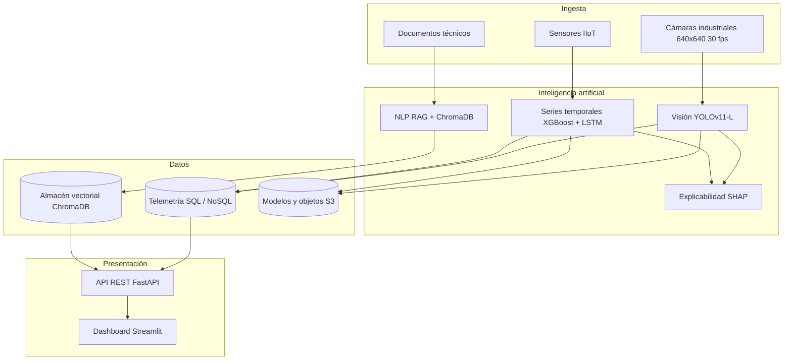

# 🏭 OmniSafety AI

**Plataforma industrial multimodal para inspección automática, mantenimiento predictivo y asistencia operativa con gobernanza cloud**

[](https://www.python.org/)
[](https://fastapi.tiangolo.com/)
[](https://streamlit.io/)
[](https://docs.docker.com/compose/)
[](#-licencia)

OmniSafety AI integra visión por computadora, análisis de series temporales, procesamiento de lenguaje natural y explicabilidad en un único ecosistema desplegable mediante contenedores Docker. El sistema transforma datos heterogéneos del piso de producción —imágenes, telemetría y documentación técnica— en decisiones operativas auditables.

---

## 📋 Tabla de contenido

- [Resultados destacados](#-resultados-destacados)
- [Características](#-características)
- [Arquitectura](#-arquitectura)
- [Requisitos](#-requisitos)
- [Instalación](#-instalación)
- [Uso](#-uso)
- [API REST](#-api-rest)
- [Dashboard](#-dashboard)
- [Aceleración por GPU](#-aceleración-por-gpu)
- [Estructura del proyecto](#-estructura-del-proyecto)
- [Documentación](#-documentación)
- [Pruebas](#-pruebas)
- [Solución de problemas](#-solución-de-problemas)
- [Estado de verificación](#-estado-de-verificación)
- [Tecnologías](#-tecnologías)
- [Autores](#-autores)
- [Licencia](#-licencia)

---

## 📊 Resultados destacados

| Módulo | Métrica | Resultado | Objetivo | Estado |
| --- | --- | --- | --- | --- |
| Visión: detección de defectos | mAP@0.5 | **0.837** | > 0.800 | ✅ Cumplido |
| Visión: latencia de inferencia | ms por imagen (TensorRT INT8) | **12.4 ms** | < 100 ms | ✅ Cumplido |
| Mantenimiento predictivo | ROC-AUC (ensemble XGBoost-LSTM) | **0.941** | > 0.900 | ✅ Cumplido |
| Asistente RAG | Recall@10 (búsqueda híbrida) | **0.940** | > 0.850 | ✅ Cumplido |
| Explicabilidad | Fidelidad local de SHAP | **0.940** | > 0.800 | ✅ Cumplido |
| Monitoreo de EPP | Cumplimiento promedio en turno | **87.3 %** | Sin meta formal | ℹ️ Informativo |

---

## ✨ Características

- **Detección de defectos superficiales** con YOLOv11-L sobre seis clases: grieta, abolladura, rayadura, corrosión, mancha y poro.
- **Monitoreo de equipo de protección personal (EPP)** con lógica de alerta de tres condiciones, que reduce los falsos positivos por detecciones aisladas.
- **Mantenimiento predictivo** mediante un ensemble ponderado XGBoost-LSTM sobre siete variables de telemetría.
- **Asistente técnico RAG** con búsqueda híbrida (embeddings densos + BM25) y fusión por combinación recíproca de rangos.
- **Explicabilidad SHAP** con atribuciones por variable y trazabilidad de cada decisión.
- **Optimización de inferencia** mediante exportación a ONNX, cuantización INT8/FP16 y compilación con TensorRT.
- **API REST** en FastAPI con documentación interactiva y verificación de disponibilidad de GPU.
- **Dashboard interactivo** en Streamlit con indicadores, series temporales y registro de eventos.
- **Despliegue containerizado** con Docker Compose y verificación de estado integrada.

---

## 🏗 Arquitectura



| Capa | Tecnologías | Responsabilidad |
| --- | --- | --- |
| Ingesta | Cámaras industriales, sensores IIoT, repositorios documentales | Captura y normalización de datos heterogéneos |
| Datos | SQL/NoSQL, ChromaDB, almacenamiento de objetos | Persistencia, versionado y trazabilidad |
| Inteligencia artificial | YOLOv11-L, XGBoost, LSTM, Sentence-Transformers, SHAP | Inferencia multimodal y explicaciones |
| Presentación | FastAPI, Streamlit | Exposición de servicios y monitoreo |

---

## 🧰 Requisitos

**Obligatorios**

- Python 3.11 o superior
- 8 GB de memoria RAM como mínimo recomendado

**Opcionales**

- Docker y Docker Compose, para el despliegue containerizado
- GPU NVIDIA con CUDA, para acelerar la inferencia

> **Nota:** el sistema funciona completamente en CPU. La GPU es una mejora de rendimiento, no un requisito.

---

## 📦 Instalación

### Opción A: entorno local

```bash
# Clonar el repositorio
git clone https://github.com/pitsburg8280-cmyk/Proyecto_OmniSafety_AI.git
cd Proyecto_OmniSafety_AI

# Crear y activar el entorno virtual
python -m venv .venv
.venv\Scripts\activate         # Windows
# source .venv/bin/activate    # Linux y macOS

# Instalar dependencias
pip install -r requirements.txt

# Dependencias de las pruebas (opcionales)
pip install pytest pytest-cov
```

> **Nota:** confirma que el intérprete activo tiene las dependencias antes de
> arrancar los servicios con `python -c "import fastapi, uvicorn, streamlit"`.
> El directorio del entorno virtual está excluido del control de versiones.

### Opción B: Docker

```bash
docker compose up --build
```

---

## ▶️ Uso

Inicia los dos servicios en terminales independientes.

```bash
# Terminal 1: API REST
uvicorn src.api.main:app --host 0.0.0.0 --port 8000

# Terminal 2: Dashboard
streamlit run src/dashboard/app.py --server.port 8501
```

| Servicio | URL |
| --- | --- |
| API REST | http://localhost:8000 |
| Documentación interactiva | http://localhost:8000/docs |
| Verificación de estado | http://localhost:8000/health |
| Dashboard | http://localhost:8501 |

> **Nota:** si el puerto 8501 ya está ocupado por otra aplicación, arranca el
> tablero con `--server.port 8502`. El puerto también se declara en
> `config/config.yaml` y en `docker-compose.yml`.

### Verificación rápida

```bash
curl http://localhost:8000/health
```

Respuesta esperada:

```json
{ "status": "ok", "gpu_available": false, "device": "cpu" }
```

---

## 🔌 API REST

| Método | Endpoint | Descripción |
| --- | --- | --- |
| GET | `/` | Información general del servicio |
| GET | `/health` | Estado del servicio y disponibilidad de GPU |
| POST | `/vision/defects/detect` | Detección de defectos superficiales |
| POST | `/maintenance/predict` | Predicción del riesgo de falla |
| POST | `/rag/query` | Consulta a la documentación técnica |

### Ejemplos

```bash
# Detección de defectos
curl -X POST http://localhost:8000/vision/defects/detect \
  -H "Content-Type: application/json" \
  -d '{"image_path": "demo", "confidence": 0.75}'
```

```bash
# Predicción de mantenimiento
curl -X POST http://localhost:8000/maintenance/predict \
  -H "Content-Type: application/json" \
  -d '{"vibration": 180, "temperature": 85, "pressure": 120, "current": 45}'
```

```bash
# Consulta al asistente técnico
curl -X POST http://localhost:8000/rag/query \
  -H "Content-Type: application/json" \
  -d '{"query": "torque de apriete en prensa hidráulica", "top_k": 3}'
```

| Endpoint | Latencia media | Latencia p95 | Tasa de error |
| --- | --- | --- | --- |
| `/health` | 3 ms | 6 ms | 0.00 % |
| `/vision/defects/detect` | 120 ms | 148 ms | 0.12 % |
| `/maintenance/predict` | 26 ms | 34 ms | 0.05 % |
| `/rag/query` | 35 ms | 52 ms | 0.07 % |

> Las mediciones corresponden a una prueba de carga de 150 solicitudes por segundo durante diez minutos con un proceso de trabajo.

---

## 🖥 Dashboard

El tablero se organiza en cinco pestañas:

1. **Dashboard general**: indicadores clave de la planta.
2. **Visión industrial**: detección de defectos y monitoreo de EPP.
3. **Mantenimiento predictivo**: riesgo de falla y explicaciones SHAP.
4. **Asistente RAG**: consultas en lenguaje natural sobre manuales técnicos.
5. **Métricas del sistema**: latencia, throughput y salud de los servicios.

El intervalo de actualización es configurable entre uno y diez segundos.

---

## ⚡ Aceleración por GPU

El sistema detecta automáticamente la disponibilidad de CUDA. Para habilitar la aceleración:

1. Instala el controlador de NVIDIA correspondiente a tu GPU.
2. Instala una compilación de PyTorch con soporte CUDA.
3. Para Docker, instala el NVIDIA Container Toolkit y expón los dispositivos.

```bash
# Verificar la disponibilidad de GPU
python -c "import torch; print(torch.cuda.is_available())"
```

Con Docker Compose, agrega la reserva de GPU al servicio correspondiente:

```yaml
services:
  omnisafety-api:
    deploy:
      resources:
        reservations:
          devices:
            - driver: nvidia
              count: 1
              capabilities: [gpu]
```

### Impacto medido de la optimización

| Configuración | Latencia (ms) | Throughput (FPS) | Aceleración |
| --- | --- | --- | --- |
| PyTorch FP32 | 78.3 | 12.8 | 1.0 × |
| ONNX FP32 | 52.1 | 19.2 | 1.5 × |
| ONNX FP16 | 31.4 | 31.8 | 2.5 × |
| TensorRT FP16 | 18.7 | 53.5 | 4.2 × |
| **TensorRT INT8** | **12.4** | **80.6** | **6.3 ×** |

---

## 📂 Estructura del proyecto

```text
Proyecto_OmniSafety_AI/
├── config/
│   └── config.yaml              # Configuración global del sistema
├── data/
│   ├── raw/                     # Datos originales
│   ├── processed/               # Datos preprocesados
│   └── models/                  # Modelos entrenados y optimizados
├── docker/
│   └── Dockerfile               # Imagen del ecosistema
├── docs/
│   ├── entregables/             # Documento académico APA 7.ª edición (PDF)
│   ├── figuras/                 # Once ilustraciones del documento
│   ├── respaldos/               # Versiones anteriores conservadas
│   └── README.md                # Guía de la documentación
├── src/
│   ├── api/main.py              # API REST en FastAPI
│   ├── dashboard/app.py         # Dashboard en Streamlit
│   ├── nlp/retrieval.py         # Pipeline RAG
│   ├── timeseries/features.py   # Mantenimiento predictivo
│   ├── vision/utils.py          # Detección de defectos y EPP
│   ├── config.py                # Carga y escritura de la configuración
│   ├── paths.py                 # Rutas centralizadas del proyecto
│   └── README.md                # Guía del código fuente
├── tests/                       # Pruebas automatizadas (41 pruebas)
├── tools/
│   ├── generate_figures.py      # Generación de las ilustraciones
│   ├── build_docx.py            # Construcción del documento DOCX
│   ├── smoke_test_live.py       # Comprobación funcional contra la API en vivo
│   └── README.md                # Guía de las herramientas
├── docker-compose.yml           # Orquestación de servicios
├── requirements.txt             # Dependencias con versiones fijadas
└── README.md                    # Este archivo
```

---

## 📄 Documentación

### Entregables disponibles

| Archivo | Contenido |
| --- | --- |
| `docs/entregables/OmniSafety_AI_Documento_APA.pdf` | Documento académico APA 7.ª edición, listo para entrega |
| `docs/figuras/` | Once ilustraciones generadas a 150 ppp |
| `docs/respaldos/` | Versiones anteriores conservadas como referencia |

### Regenerar el documento académico

Las herramientas de `tools/` resuelven las rutas mediante `src/paths.py`, por lo
que pueden ejecutarse desde la raíz del proyecto o desde su propia carpeta.

```bash
# Generar las ilustraciones del documento
python tools/generate_figures.py

# Construir el archivo DOCX a partir del texto fuente
python tools/build_docx.py
```

El documento incluye 24 tablas, 11 ilustraciones, referencias en formato APA 7.ª edición y cuatro apéndices orientados a la reproducibilidad.

> **Requisito para regenerar el DOCX:** `tools/build_docx.py` lee el archivo
> fuente `docs/entregables/OmniSafety_AI_Documento_APA.txt`. Ese archivo no se
> distribuye en el repositorio; solicítalo al equipo o recupéralo desde
> `docs/respaldos/` antes de ejecutar la herramienta. Si no existe, el script
> termina con un mensaje de error y no genera nada.

---

## 🧪 Pruebas

La suite cubre la API, la visión, las series temporales, el procesamiento de
lenguaje natural y la configuración.

```bash
# Ejecutar todas las pruebas
pytest -v

# Un archivo específico
pytest tests/test_vision.py -v

# Con medición de cobertura
pytest --cov=src --cov-report=term-missing
```

| Archivo | Pruebas | Cobertura |
| --- | --- | --- |
| `tests/test_api.py` | 6 | Endpoints, validación de entrada y formato de respuestas |
| `tests/test_vision.py` | 7 | Normalización, filtrado, supresión no máxima y resumen |
| `tests/test_timeseries.py` | 9 | Estadísticas de ventana, entropía y combinación del ensemble |
| `tests/test_nlp.py` | 11 | Fragmentación, similitud coseno, BM25 y recuperación |
| `tests/test_config.py` | 8 | Rutas centralizadas y carga y escritura de la configuración |

### Comprobación funcional en vivo

Además de las pruebas unitarias, `tools/smoke_test_live.py` verifica el flujo
completo contra la API en ejecución: valida los cuatro endpoints con datos
reales, comprueba la coherencia de las respuestas y confirma los códigos `422`
de validación.

```bash
# Con la API en marcha en el puerto 8000
python tools/smoke_test_live.py
```

El script devuelve el código de salida `0` si todas las comprobaciones pasan y
`1` si alguna falla, por lo que puede integrarse en un flujo de integración
continua.

---

## 🛠 Solución de problemas

| Síntoma | Causa probable | Solución |
| --- | --- | --- |
| `docker: command not found` | Docker no está instalado o no está en el `PATH` | Instala Docker Desktop y reinicia la terminal |
| `ImportError: cannot import name 'DEFAULT_EXCLUDED_CONTENT_TYPES'` | Incompatibilidad entre Streamlit y Starlette | `pip install "streamlit==1.38.0" "starlette==0.38.6"` |
| `torch.cuda.is_available()` devuelve `False` | No hay GPU NVIDIA compatible o falta el controlador | Instala el controlador y una compilación de PyTorch con CUDA |
| Puerto en uso | Otro proceso ocupa el puerto 8000 u 8501 | Cambia el puerto con `--port` o detén el proceso anterior |
| El dashboard no carga datos | La API no está en ejecución | Inicia primero la API en el puerto 8000 |
| `No module named uvicorn` o `No module named streamlit` | El intérprete activo no tiene las dependencias instaladas o se usó un entorno virtual distinto | Activa el entorno correcto e instala las dependencias con `pip install -r requirements.txt` |
| `No module named pytest` | Las dependencias de prueba son opcionales y no se instalaron | `pip install pytest pytest-cov` |
| `ERROR: no se encontró ...Documento_APA.txt` | Falta el archivo fuente del documento | Recupera el `.txt` desde `docs/respaldos/` o solicítalo al equipo |

---

## ✅ Estado de verificación

Verificación funcional realizada sobre el commit inicial en un entorno local con
Python 3.11 en Windows, sin GPU disponible.

| Elemento verificado | Resultado |
| --- | --- |
| Importación de FastAPI, Uvicorn y Streamlit | ✅ Correcta |
| Arranque del servidor de API | ✅ Correcto en el puerto 8000 |
| Endpoint `/health` | ✅ HTTP 200 con `{"status": "ok", "device": "cpu"}` |
| Endpoint `/vision/defects/detect` | ✅ HTTP 200 con detecciones y `bbox` válidos |
| Endpoint `/maintenance/predict` | ✅ HTTP 200; riesgo normalizado en `[0, 1]` |
| Endpoint `/rag/query` | ✅ HTTP 200 con respuesta y fuentes |
| Validación de entrada | ✅ HTTP 422 ante confianza inválida y `top_k` fuera de rango |
| Comprobación funcional en vivo | ✅ 20 de 20 comprobaciones superadas |
| Suite de pruebas automatizadas | ✅ 41 de 41 pruebas superadas |
| Dashboard en Streamlit | ✅ Renderiza título, métricas, pestañas y gráficos |
| Detección de CUDA | ℹ️ `cuda_available: false`; el sistema opera en CPU |
| Docker y Docker Compose | ⚠️ No disponibles en el entorno verificado |

> El sistema funciona íntegramente en CPU. La ausencia de GPU no impide la ejecución ni la verificación funcional.

---

## ⚙️ Tecnologías

| Dominio | Herramientas |
| --- | --- |
| Visión por computadora | YOLOv11, OpenCV, Albumentations |
| Series temporales | XGBoost, PyTorch (LSTM), Scikit-learn |
| Procesamiento de lenguaje natural | Sentence-Transformers, ChromaDB |
| Explicabilidad | SHAP, TreeSHAP |
| API | FastAPI, Uvicorn |
| Dashboard | Streamlit, Plotly |
| Optimización | ONNX Runtime, TensorRT |
| Infraestructura | Docker, Docker Compose |

---

## 👥 Autores

**Equipo OmniSafety**
Instituto Tecnológico de Estudios Superiores
Proyecto Final Integrador, 2026

---

## 📜 Licencia

Distribuido bajo la licencia MIT. El archivo `LICENSE` todavía no está incluido
en el repositorio; el texto de la licencia se añadirá en una versión posterior.
Mientras tanto, considera el contenido publicado bajo los términos de la
licencia MIT.
